# 🎓 Student Management System

A Flask-based **Student Management System** that enables administrators to manage student records efficiently through a clean and responsive web interface.

The application provides secure user authentication, complete CRUD operations, search functionality, pagination, dashboard statistics, and flash messaging using **Flask**, **SQLAlchemy**, **MariaDB**, and **Bootstrap 5**.

---

# 📚 Table of Contents

- Project Overview
- Features
- Technology Stack
- Project Structure
- Screenshots
- Prerequisites
- Installation
- Database Setup
- Environment Variables
- Running the Application
- Future Improvements
- Author

---

# 🚀 Project Overview

The Student Management System is a web application built with Flask that allows authenticated users to manage student information.

Users can:

- Login securely
- Add new students
- View all students
- Edit student information
- Delete students
- Search students
- Navigate student records using pagination

The project follows a modular Flask architecture using Blueprints and SQLAlchemy ORM.

---

# ✨ Features

## 🔐 Authentication

- User Login
- User Logout
- Password Hashing
- Session Management
- Protected Routes

---

## 👨‍🎓 Student Management

- Add Student
- View Students
- Edit Student
- Delete Student

---

## 🔍 Search

Search students by:

- Name
- Email
- Course

---

## 📄 Pagination

- 5 Records Per Page
- Previous / Next Buttons
- Page Numbers

---

## 📊 Dashboard

Displays:

- Total Students
- Total Users

---

## 🎨 User Interface

- Bootstrap 5
- Responsive Design
- Flash Messages
- Clean Navigation Bar

---

# 🛠 Technology Stack

## Backend

- Python
- Flask
- SQLAlchemy

## Database

- MariaDB

## Frontend

- HTML5
- Bootstrap 5
- Jinja2

## Version Control

- Git
- GitHub

## Operating System

- Ubuntu Linux

---

# 📁 Project Structure

```
student-management-system/
│
├── app.py
├── config.py
├── requirements.txt
├── .env
│
├── models/
│   ├── __init__.py
│   ├── student.py
│   └── user.py
│
├── routes/
│   ├── auth.py
│   ├── home.py
│   └── student.py
│
├── templates/
│   ├── base.html
│   ├── index.html
│   ├── login.html
│   ├── students.html
│   ├── add_student.html
│   └── edit_student.html
│
├── static/
│
├── utils/
│   └── auth.py
│
└── screenshots/
```

---

# 📸 Screenshots

## 🏠 Landing Page

The landing page provides a brief overview of the Student Management System before user authentication.

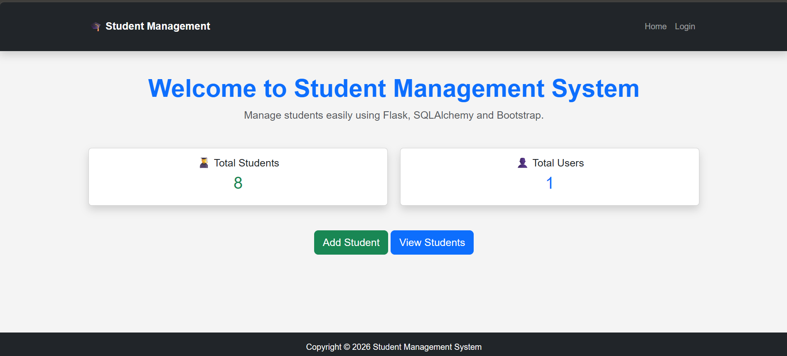

---

## 🔐 Login Page

Secure login page for authenticated users.

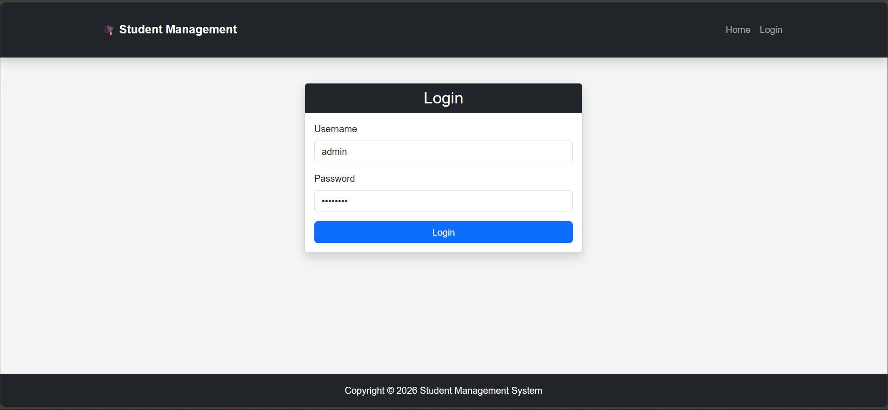
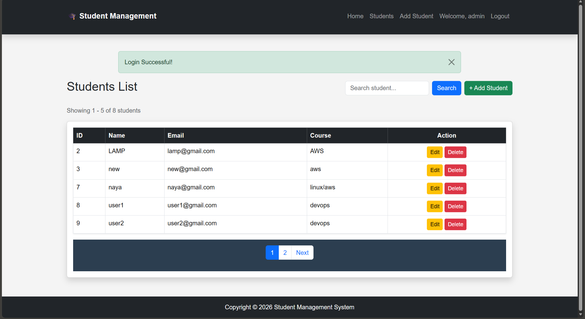

---

## 📊 Dashboard

Displays system statistics, including the total number of students and registered users.

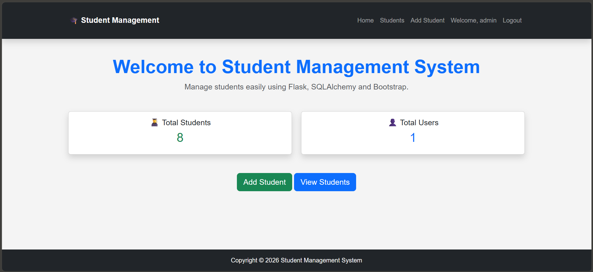

---

## 👨‍🎓 Students List

View all students with search and pagination.

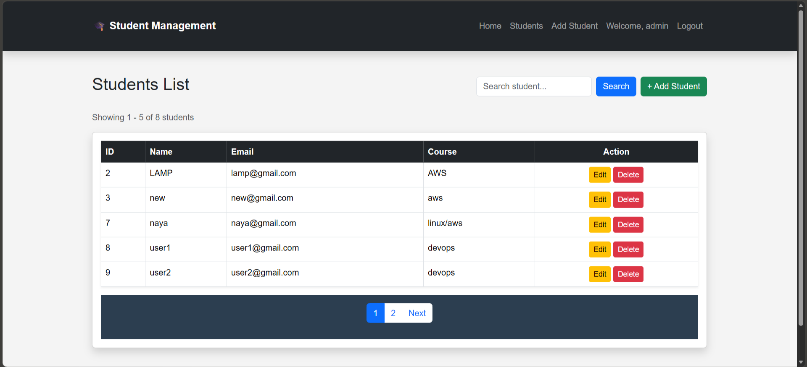

---

## ➕ Add Student

Add a new student to the database.

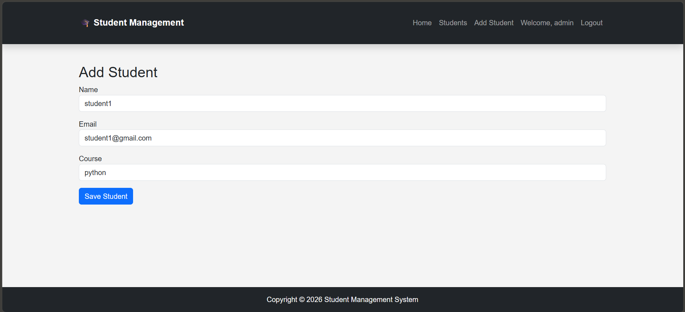
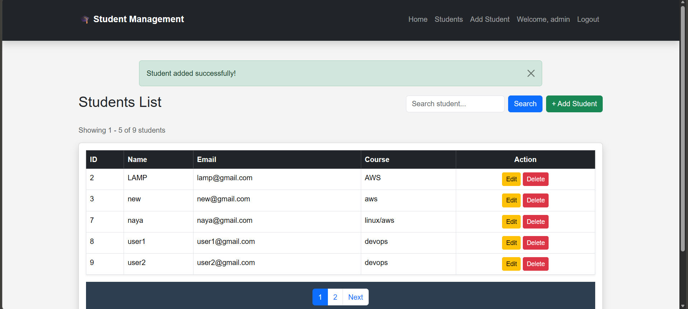

---

## ✏️ Edit Student

Update existing student information.

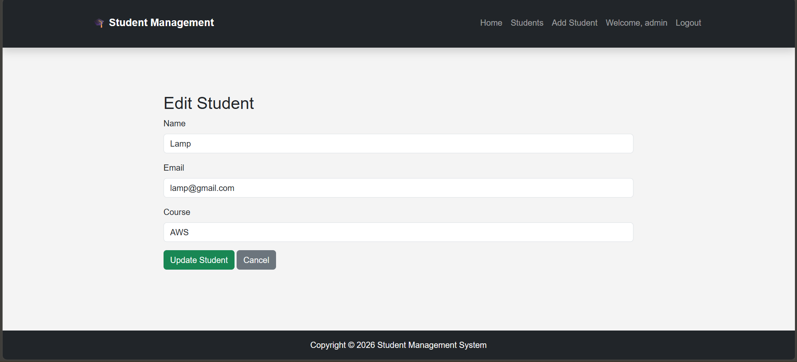
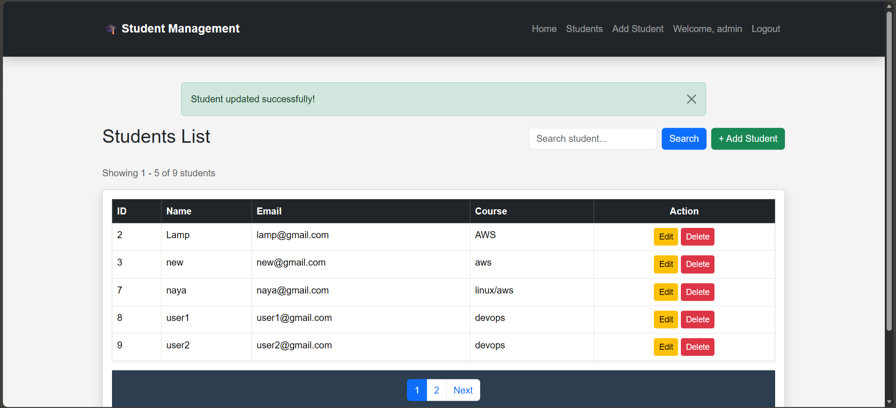

---

## 🔍 Search Students

Search students by name, email, or course.

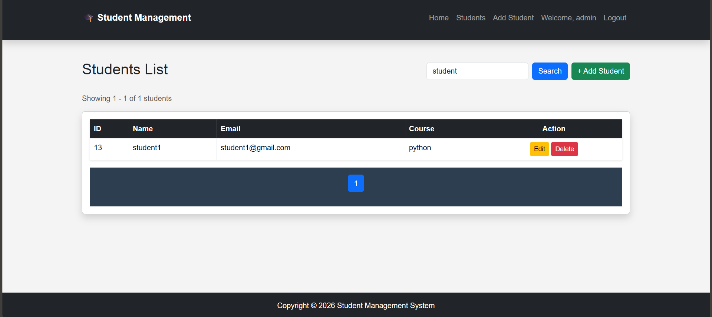

---

## 📄 Pagination

Navigate through multiple pages of student records.


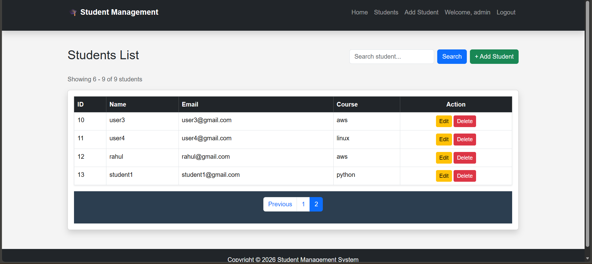


---
## 🗑️ Delete Student

Delete a student record with a confirmation prompt to prevent accidental deletion.

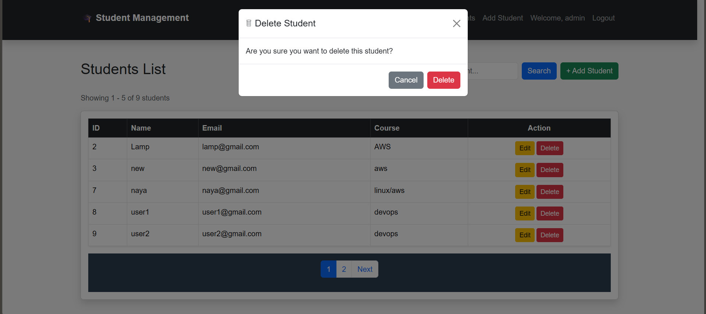
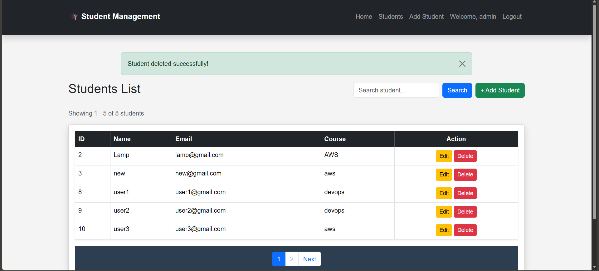

---

## 🚪 Logout

Users can securely log out of the application. After logging out, protected pages cannot be accessed unless the user logs in again.

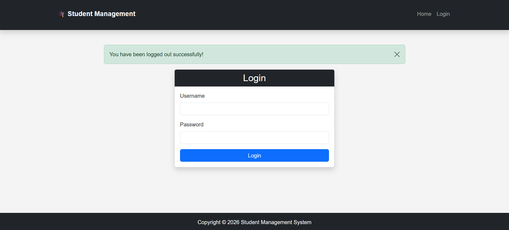

---


# 📋 Prerequisites


Before running this project, make sure you have:

- Python 3.10 or later
- pip
- Git
- MariaDB

---

# ⚙️ Installation

## Clone the Repository

```bash
git clone https://github.com/tanmay-badwaik/student-management-system.git

cd student-management-system
```

---

## Create Virtual Environment

Linux

```bash
python3 -m venv venv
```

Windows

```bash
python -m venv venv
```

---

## Activate Virtual Environment

Linux

```bash
source venv/bin/activate
```

Windows

```bash
venv\Scripts\activate
```

---

## Install Project Dependencies

```bash
pip install -r requirements.txt
```

---

# 💾 Database Setup

Login to MariaDB

```bash
mysql -u root -p
```

Create Database

```sql
CREATE DATABASE student_management;
```

---

# 🔐 Environment Variables

Create a `.env` file in the project root directory.

Example:

```env
SECRET_KEY=your-secret-key

DB_HOST=localhost
DB_PORT=3306
DB_NAME=student_management

DB_USER=root
DB_PASSWORD=your-password
```

---

# ▶️ Running the Application

Run the Flask development server.

```bash
python app.py
```

Open your browser.

```
http://SERVER_IP:5000
```

---

# 📈 Future Improvements

The following features are planned:

- Gunicorn Deployment
- Nginx Reverse Proxy
- Systemd Service
- Docker
- Docker Compose
- Jenkins CI/CD Pipeline
- Terraform
- Kubernetes Deployment
- AWS EC2 Production Deployment
- HTTPS using Let's Encrypt

---

# 🤝 Contributing

Contributions are welcome.

Feel free to fork this repository and submit a pull request.

---

# 👨‍💻 Author

**Tanmay Badwaik**


- Developed this project as part of my learning journey in **Python, Flask, AWS, and DevOps**.
- GitHub: https://github.com/tanmay-badwaik

---

⭐ If you found this project useful, consider giving it a star on GitHub.